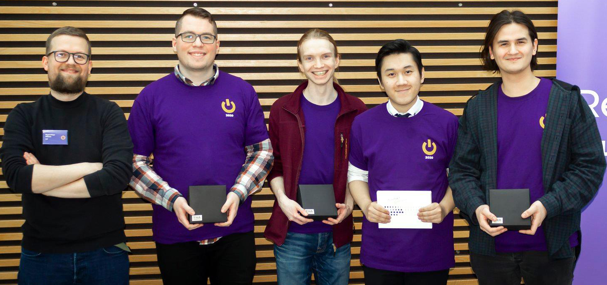
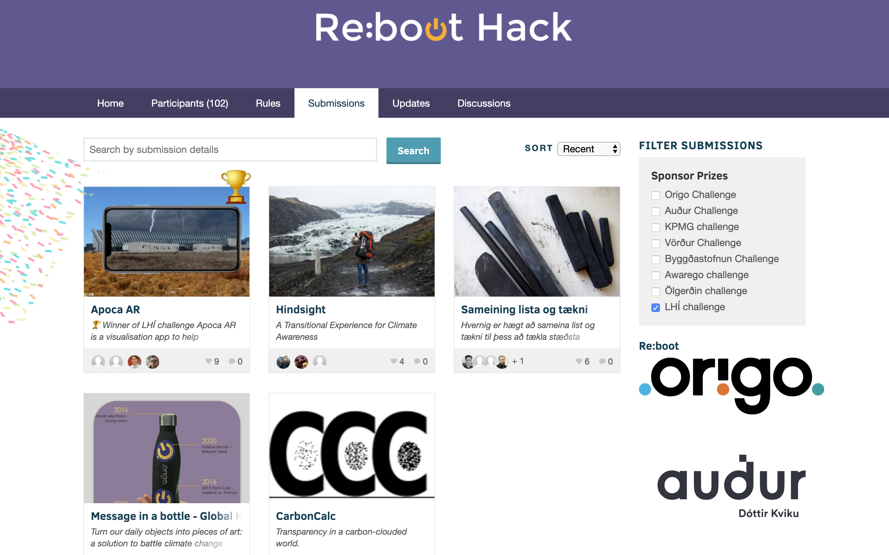

# Reboot Hack 2020: Apoca AR

## What it is
Apoca AR simulates a prediction of the world of 2070 if the climate crisis isn't fought harder. Standing in an Apoca AR viable spot, people will be able to see into the future, based on underlying data given from Iceland weather statistics.

## Data used

## Live demo
https://davidhs.github.io/reboot-hack-2020-panorama/

## LHÍ challenge prize photo
 

  
   

## Project members
* Arttu Lakkala
* [Davíð Helgason](https://github.com/davidhs)
* Hieu Van Phan
* [Kristinn Godfrey Guðnason](https://github.com/KristinnGodfrey)
