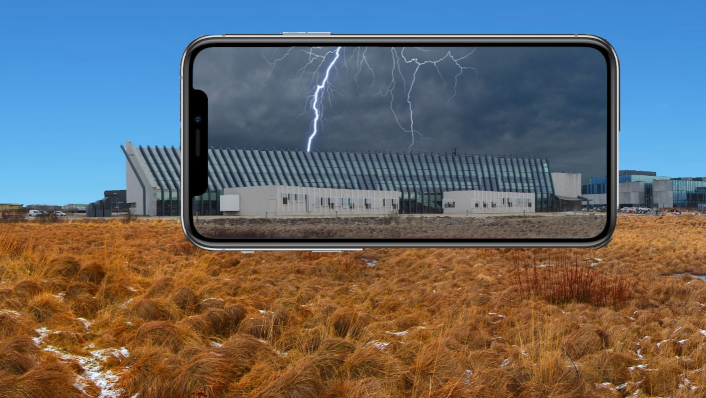
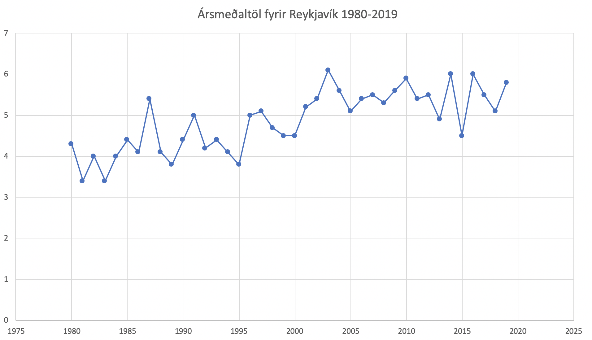

# Reboot Hack 2020: Apoca AR

## What it is
Apoca AR simulates a prediction of the world of 2070 if the climate crisis isn't fought harder. Standing in an Apoca AR viable spot; people will be able to see into the future in the midst of a climate catastrophe, based on underlying data.

## Data used
Our data was extracted from the Icelandic meteorological office: [vedur.is](http://vedur.is)

## Live demo
https://davidhs.github.io/reboot-hack-2020-panorama/

## LHÍ challenge

   
    

## Project members
* Arttu Lakkala
* [Davíð Helgason](https://github.com/davidhs)
* Hieu Van Phan
* [Kristinn Godfrey Guðnason](https://github.com/KristinnGodfrey)
